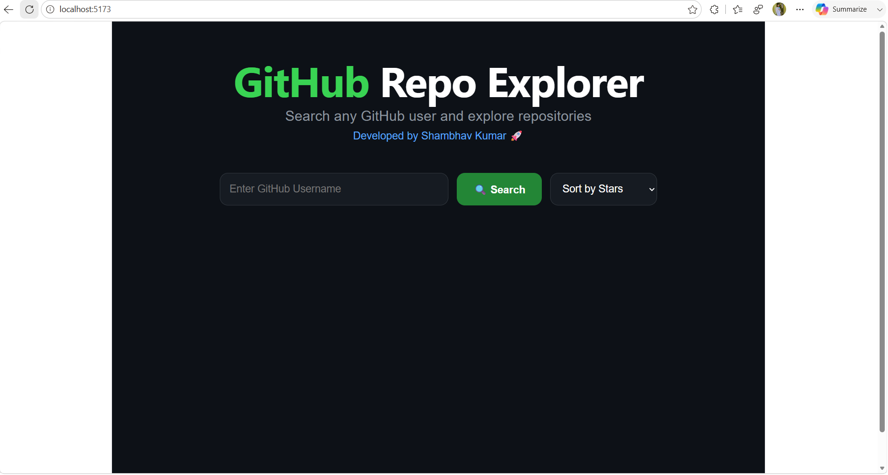
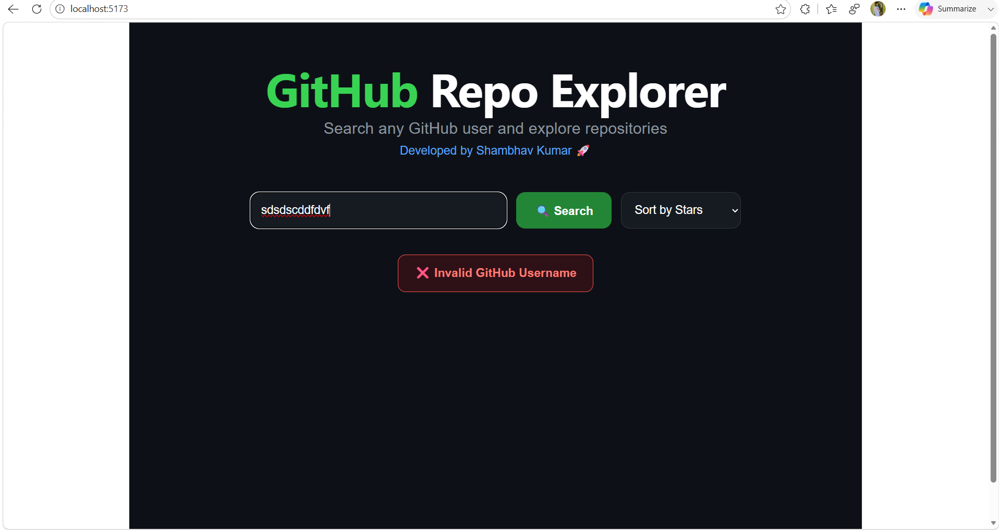
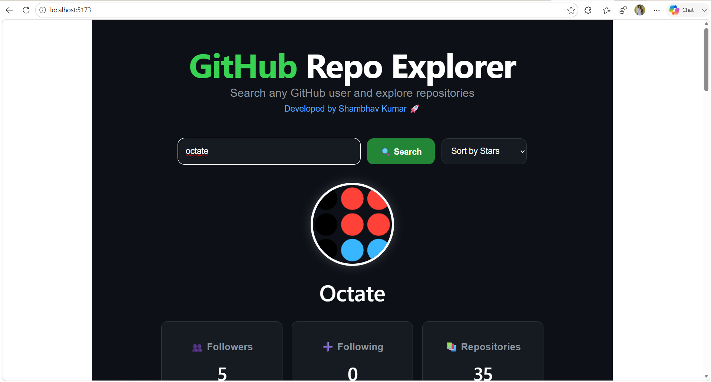
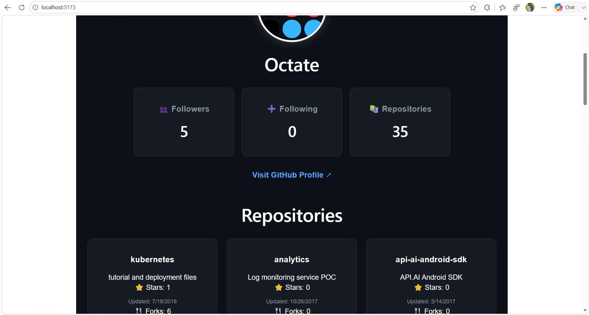
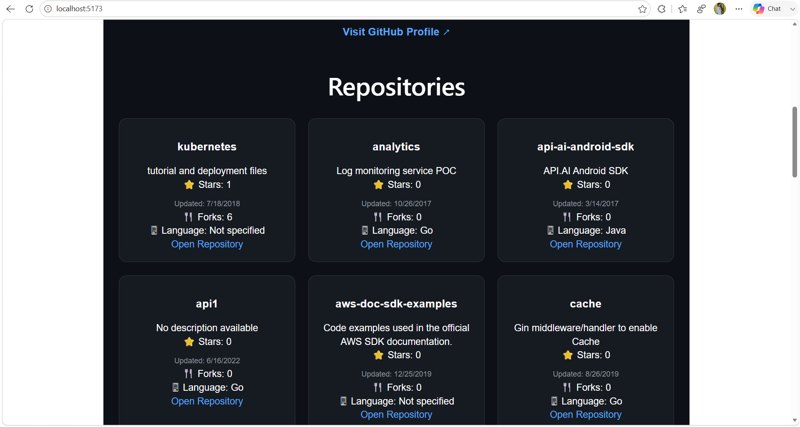

# 🚀 GitHub Repo Explorer

A modern full-stack GitHub Repo Explorer built using **React.js**, **Node.js**, **Express.js**, and the **GitHub API**.

Search GitHub users, explore repositories, sort repositories, and view profile statistics in a beautiful and responsive UI.

---

# 🌟 Features

✅ Search any GitHub user
✅ Explore repositories instantly
✅ View followers, following, and repository count
✅ Sort repositories by:

* ⭐ Stars
* 📘 Name

✅ Beautiful modern dark UI
✅ Responsive design
✅ Error handling for invalid usernames
✅ Real-time GitHub API integration
✅ Professional portfolio-ready project

---

# 🛠️ Tech Stack

## Frontend

* React.js
* Axios
* Vite

## Backend

* Node.js
* Express.js
* CORS

## API

* GitHub REST API

---

# 📂 Project Structure

```bash
github-repo-explorer
│
├── client
│   ├── src
│   │   ├── components
│   │   │   └── RepoCard.jsx
│   │   ├── App.jsx
│   │   └── main.jsx
│   │
│   └── package.json
│
├── server
│   ├── routes
│   │   └── githubRoutes.js
│   │
│   ├── server.js
│   └── package.json
│
└── README.md
```

---

# ⚙️ Installation

## Clone Repository

```bash
git clone https://github.com/itzshambhav/github-repo-explorer.git
```

---

# 🚀 Frontend Setup

```bash
cd client
npm install
npm run dev
```

Frontend runs on:

```bash
http://localhost:5173
```

---

# 🚀 Backend Setup

```bash
cd server
npm install
npm run dev
```

Backend runs on:

```bash
http://localhost:5000
```

---

# 🔗 API Endpoint

```bash
GET /api/github/:username
```

Example:

```bash
http://localhost:5000/api/github/octocat
```

---

# 📸 Features Preview

## 🔍 User Search

Search any GitHub profile instantly.

## 👤 Profile Information

Displays:

* Avatar
* Name
* Bio
* Followers
* Following
* Public Repositories

## 📦 Repository Explorer

Displays:

* Repository Name
* Description
* Stars
* Forks
* Language
* Last Updated Date

---

# 🎨 UI Highlights

* Modern Dark Theme
* Responsive Layout
* Professional Cards
* Hover Effects
* Smooth Design
* Portfolio Quality UI

---

# 🧠 Concepts Used

* React Hooks
* useState
* API Fetching
* Express Routing
* Async/Await
* Component Reusability
* REST API Integration

---

---

# 📸 Screenshots

## 🏠 Home Page



---

## ❌ Invalid Username Handling



---

## 👤 User Profile Section



---

## 📊 GitHub Statistics Cards



---

## 📦 Repository Explorer



---

# 🔮 Future Improvements

* Pagination
* Repository filtering
* Search history
* GitHub contribution graph
* AI repository summary
* Light/Dark theme toggle

---

# 👨‍💻 Developed By

## Shambhav Kumar 🚀

Passionate Full Stack Developer focused on:

* AI/ML
* MERN Stack
* Modern Web Development
* Scalable Applications

GitHub:
https://github.com/itzshambhav

---

# ⭐ Support

If you like this project, give it a ⭐ on GitHub.

---.
